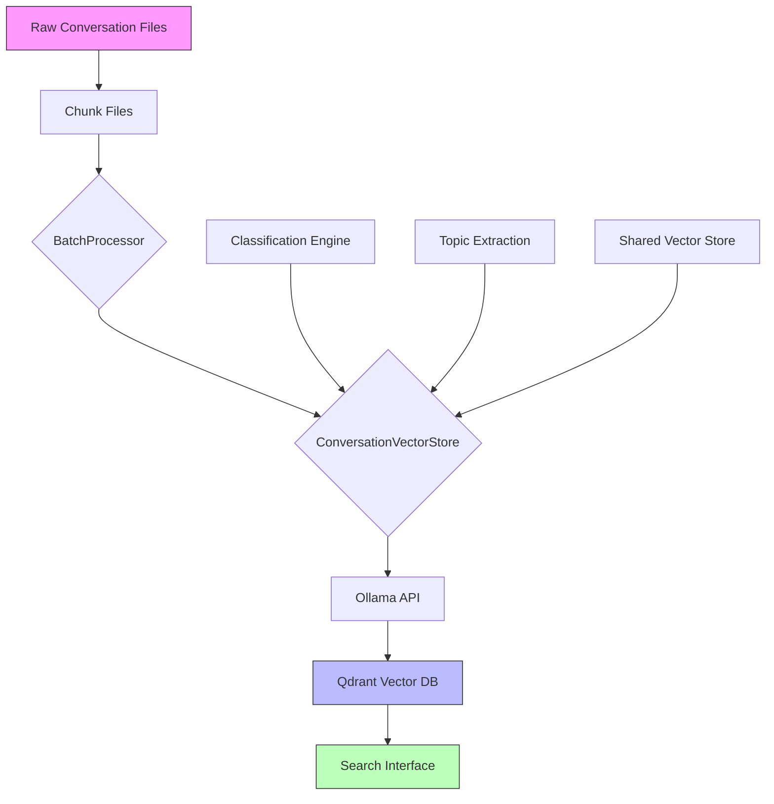

# Conversation Mind Data Flow Architecture

## Overview
This document outlines the data flow architecture of the Conversation Mind system, showing how data moves from raw conversation files through various processing stages to searchable vector embeddings.

## Core Components

### 1. Data Storage Layer
- **Qdrant Vector Store** (./qdrant_db)
  - Stores conversation embeddings
  - Enables semantic search
  - Manages vector indices

### 2. Processing Components
- **BatchProcessor**
  - Handles chunk-based processing
  - Implements retry logic
  - Tracks processing checkpoints

- **ConversationVectorStore**
  - Generates embeddings (using Ollama's mxba-embed-large model)
  - Manages Qdrant interactions
  - Provides search capabilities
  - Implements singleton pattern

### 3. Shared Resources
- **Vector Store Singleton**
  - Ensures single instance across pages
  - Handles lock file management

## Data Flow Sequence



## Processing Pipeline

1. **Initial Data Loading**
   ```
   Raw Files → Chunk Files → BatchProcessor → ConversationVectorStore
   ```
   - Chunks loaded with adaptive batch sizing
   - Progress tracking and checkpointing
   - Error handling with retries

2. **Vector Processing**
   ```
   ConversationVectorStore → Ollama API → Embeddings → Qdrant
   ```
   - Text extraction and cleaning
   - Embedding generation (using Ollama)
   - Vector storage and indexing

3. **Search Flow**
   ```
   Query → Ollama API → Embedding → Vector Search → Results
   ```
   - Query embedding generation (using Ollama)
   - Similarity search in Qdrant
   - Optional time-based filtering

## Performance Considerations

1. **Memory Management**
   - Adaptive batch sizing based on memory usage
   - Streaming JSON parsing for large files

2. **Error Handling**
   - Exponential backoff for retries
   - Checkpoint-based recovery
   - Detailed error logging

3. **Resource Optimization**
   - Singleton pattern for shared resources
   - Caching of vector store instance
   - Efficient file locking mechanism

## Monitoring and Logging

1. **System Health**
   - Memory usage tracking
   - Disk space monitoring
   - Processing rate metrics

2. **Progress Tracking**
   - Chunk processing status
   - Success/failure rates
   - Performance metrics

3. **Error Logging**
   - Detailed error messages
   - Retry attempts tracking
   - System health updates

## Security Measures

1. **File Access**
   - Lock file management
   - Safe file operations
   - Resource cleanup


## Integration Points

1. **Web Interface**
   - Streamlit-based UI
   - Progress indicators
   - Status updates

2. **Vector Store Integration**
   - Shared instance management
   - Cross-page accessibility
   - Resource optimization
